# Table of Contents

- [CHS-CSB-Processing](#chs-csb-processing)
  - [Description](#description)
- [Graphical User Interface (GUI)](#graphical-user-interface-gui)
- [Command-Line Interface Tutorial for Bathymetric File Processing](#command-line-interface-tutorial-for-bathymetric-file-processing)
  - [Available Commands](#available-commands)
    - [1. `process` Command](#1-process-command)
      - [Syntax](#syntax)
      - [Arguments](#arguments)
      - [Available Options](#available-options)
      - [Usage Examples](#usage-examples)
    - [2. `convert` Command](#2-convert-command)
      - [Syntax](#syntax-1)
      - [Arguments](#arguments-1)
      - [Available Options](#available-options-1)
      - [Supported Output Formats](#supported-output-formats)
      - [Usage Examples](#usage-examples-1)
  - [Error Handling](#error-handling)
    - [Invalid Files](#invalid-files)
    - [Missing Parameters](#missing-parameters)
    - [Restrictions and Validations](#restrictions-and-validations)
- [Processing Flow Diagram](#processing-flow-diagram)
- [Configuration File (TOML)](#configuration-file-toml)
  - [Main Sections](#main-sections)
- [Vessel File (Vessels)](#vessel-file-vessels)
  - [Field Descriptions](#field-descriptions)


---

# CHS-CSB-Processing

CHS-CSB-Processing is currently under development. Several features are still incomplete or under development.
You can visit the [documentation](https://chs-csb-processing.readthedocs.io/en/latest/) for more information.

---

## Description

This module is designed to automate the processing of bathymetric data files. It allows you to:
- Identify and load appropriate files (CSV, TXT, XYZ, GeoJSON).
- Perform georeferencing based on specific configurations.
- Manage vessel identifiers and associated configurations.
- Convert processed files to different output formats.

The supported file formats are as follows:
- OFM: `.xyz` extension with at least the columns `LON`, `LAT`, `DEPTH`, `TIME` in the header.
- DCDB: `.csv` extension with at least the columns `LON`, `LAT`, `DEPTH`, `TIME` in the header.
- Lowrance: `.csv` extension with at least the columns `Longitude[°WGS84]`, `Latitude[°WGS84]`, `WaterDepth[Feet]`, 
            `DateTime[UTC]` in the header. These files are the result of `SL3` files from Lowrance exported by 
            the tool [SL3Reader](https://github.com/halmaia/SL3Reader).
- Actisense: coming soon.
- BlackBox: `.TXT` extension without header with columns in the order `Time`, `Date`, `Latitude`, `Longitude`, `Speed (km/h)` and `Depth (m)`.
- [WIBL](https://github.com/CCOMJHC/WIBL/tree/main): numeric extension (e.g., `.1`, `.2`, `.3`, etc.).

---

# Graphical User Interface (GUI)

A graphical user interface (GUI) is available to facilitate the processing of bathymetric files. You can launch the GUI by running the following command:

```bash
python web_ui.py
```

---

# Command-Line Interface Tutorial for Bathymetric File Processing

This tutorial provides a detailed explanation of how to use the command-line module to process and georeference 
bathymetric data files. It covers every parameter and provides practical examples.

The CLI now offers two main commands:
- `process`: for processing and georeferencing bathymetric data
- `convert`: for converting GPKG/GeoJSON files to different formats

---

## Available Commands

### 1. `process` Command

Processes bathymetric data files and georeferences them.

#### Syntax
```bash
python cli.py process [FILES...] [OPTIONS]
```

#### Arguments
- `FILES`: One or more paths to files or directories to process. Supported formats:
  - `.csv`, `.txt`, `.xyz`, `.geojson`
  - Numeric extensions (`.1`, `.2`, `.3`, etc.)

#### Available Options

| Option | Type | Required | Description                                                                                                                                                    |
|--------|------|--------|----------------------------------------------------------------------------------------------------------------------------------------------------------------|
| `--output` | Path | **Yes** | Output directory path                                                                                                                                          |
| `--vessel` | Text | No | Vessel identifier. If not specified, a default vessel with lever arms at 0 will be used. **Incompatible with `--waterline`**                                   |
| `--waterline` | Decimal | No | Vessel waterline in meter (vertical distance between sounder and water surface). If not specified, a value of 0 will be used. **Incompatible with `--vessel`** |
| `--config` | Path | No | Configuration file path. If not specified, the default configuration file will be used                                                                         |
| `--apply-water-level` | Boolean | No | Apply water level reduction when georeferencing soundings (default: `true`)                                                                                    |

#### Usage Examples

**Basic processing with default vessel:**
```bash
python cli.py process data.csv --output ./results
```

**Processing with specific vessel:**
```bash
python cli.py process data.csv --vessel "CCGS_CARTIER" --output ./results
```

**Processing with custom waterline:**
```bash
python cli.py process data.csv --waterline 2.5 --output ./results
```

**Processing with custom configuration:**
```bash
python cli.py process data.csv --config ./custom_config.toml --output ./results
```

**Processing without water level reduction:**
```bash
python cli.py process data.csv --apply-water-level false --output ./results
```

**Processing multiple files:**
```bash
python cli.py process file1.csv file2.xyz directory/ --output ./results
```

### 2. `convert` Command

Converts GPKG/GeoJSON files to different output formats.

#### Syntax
```bash
python cli.py convert [INPUT_FILES...] [OPTIONS]
```

#### Arguments
- `INPUT_FILES`: One or more GPKG (`.gpkg`) or GeoJSON (`.geojson`) files to convert

#### Available Options

| Option | Type | Required | Description |
|--------|------|----------|-------------|
| `--output` | Path | **Yes** | Output directory path |
| `--format` | Multiple choice | **Yes** | Desired output format(s). Can be specified multiple times to export to multiple formats |
| `--config` | Path | No | Configuration file path. If not specified, the default configuration file will be used |
| `--group-by-iho-order` | Boolean | No | Group data by IHO order during export (default: `false`) |

#### Supported Output Formats

The following formats are available via the `--format` option:

- `geojson` - GeoJSON format
- `gpkg` - GeoPackage format
- `csar` - CSAR format
- `parquet` - Apache Parquet format
- `feather` - Apache Feather format
- `csv` - CSV format
- `geotiff` - GeoTIFF format

#### Usage Examples

**Convert to single format:**
```bash
python cli.py convert input.gpkg --output ./output --format geojson
```

**Convert to multiple formats:**
```bash
python cli.py convert input.gpkg --output ./output --format geojson --format csv --format parquet
```

**Convert with IHO order grouping:**
```bash
python cli.py convert input.gpkg --output ./output --format gpkg --group-by-iho-order true
```

**Convert multiple files:**
```bash
python cli.py convert file1.gpkg file2.geojson --output ./output --format geotiff
```

**Convert with custom configuration:**
```bash
python cli.py convert input.gpkg --output ./output --format csv --config ./custom_config.toml
```

---

## Error Handling

The module includes robust error handling to avoid unexpected interruptions. Below are the main cases covered:

### Invalid Files
- **Issue**: If a provided file is invalid (incorrect format or non-existent).
- **Solution**: The script logs an error and skips invalid files.
  ```bash
  [ERROR] No valid files to process.
  ```

### Missing Parameters
- **Issue**: If a required parameter such as `--output` is missing or there are no files to process.
- **Solution**: The script displays an error message explaining the missing parameter.
  ```bash
  [ERROR] The --output parameter is required.
  ```

### Restrictions and Validations

1. **Mutually exclusive options**: The `--vessel` and `--waterline` options cannot be used simultaneously in the `process` command.

2. **Waterline validation**: The `--waterline` value must be positive.

3. **Supported files for `process`**:
   - Extensions: `.csv`, `.txt`, `.xyz`, `.geojson`
   - Numeric extensions: `.1`, `.2`, `.3`, etc.

4. **Supported files for `convert`**:
   - Only: `.gpkg` and `.geojson`

### Default Behavior

- If neither vessel nor waterline is specified, a default vessel with lever arms at 0 will be used
- If no configuration file is provided, the default configuration will be used
- Water level reduction is applied by default during georeferencing
- Processing can be performed on individual files or entire directories (recursive processing)

The CLI displays explicit error messages in French and English to facilitate debugging and ensure correct system usage.

---

# Processing Flow Diagram

```mermaid
flowchart TD
    %% Global styles for the diagram
    classDef start fill:#66FF66,stroke:#009900,stroke-width:2px,color:#000000,font-weight:bold
    classDef process fill:#B9E0FF,stroke:#0078D7,stroke-width:1px,color:#000000
    classDef decision fill:#FFD700,stroke:#B8860B,stroke-width:1px,color:#000000
    classDef endNode fill:#FFA500,stroke:#FF4500,stroke-width:2px,color:#000000,font-weight:bold
    classDef highlighted fill:#CCEBFF,stroke:#0078D7,stroke-width:1px,color:#000000,font-weight:bold
    classDef iteration fill:#FF9ED2,stroke:#E63F8B,stroke-width:1px,color:#000000
    classDef export fill:#CCFFCC,stroke:#009900,stroke-width:1px,color:#000000

    %% Diagram nodes
    Start[Begin CSB workflow] --> Config[Loading configurations]
    Config --> CarisConfig{CSAR format required ?}
    CarisConfig -->|Yes| LoadCarisAPI[Loading Caris API configuration]
    CarisConfig -->|No| VesselConfig["<b>Loading vessel manager</b>
    • Retrieving vessel configuration"]
    LoadCarisAPI --> VesselConfig

    VesselConfig --> ParseFiles["<b>Parsing raw files:</b>
    • Format identification
    • Data reading
    • Conversion to GeoDataFrame
    • Pre-filtering of data"]
    ParseFiles --> CleanData["<b>Data cleaning and filtering:</b>
    • Duplicate removal
    • Min/max depth filtering
    • Invalid coordinate filtering
    • Invalid timestamp filtering
    • Min/max speed filtering"]
    CleanData --> CheckData{Valid data ?}
    CheckData -->|No| EndNoData[End: no valid data]
    CheckData -->|Yes| Outliers[Outlier detection]
    Outliers --> GetSensors[Retrieving sensor configurations based on vessel]

    GetSensors --> ApplyWL{Apply water level ?}
    ApplyWL -->|No| GeoreferenceNoWL["<b>Georeferencing without water level:</b>
    • TVU calculation
    • THU calculation
    • Survey order calculation"]
    GeoreferenceNoWL --> ExportNoWL[Exporting data & metadata]
    ExportNoWL --> EndNoWL[End: georeferenced data without water level]

    ApplyWL -->|Yes| LoadIWLS[Loading IWLS API configuration]
    LoadIWLS --> RunIter["run = 1, excluded_stations = (empty)"]

    RunIter --> IterCheck{run <= max_iterations ?}
    IterCheck -->|No| EndMaxRun[Incomplete processing: max iterations reached]
    EndMaxRun --> PlotWL

    IterCheck -->|Yes| GetVoronoi["Retrieving tidal zones (Voronoi)
    without excluded stations"]
    GetVoronoi --> GetTideInfo[Retrieving tidal zone information
    intersecting with data]

    GetTideInfo --> GetWaterLevel[Retrieving water level data
    for each station]
    GetWaterLevel --> ExportWL[Exporting water level data]
    ExportWL --> Georeference["<b>Georeferencing bathymetric data:</b>
    • Applying water levels
    • TVU calculation
    • THU calculation
    • Survey order calculation"]

    Georeference --> DataComplete{Processing completed ?
    DEPTH_PROCESSED_METER without NaN ?}
    DataComplete -->|Yes| PlotWL[Creating water level charts]

    DataComplete -->|No| AddExcluded[Adding problematic stations
    to exclude]
    AddExcluded --> Increment[run += 1]
    Increment --> IterCheck

    PlotWL --> ExportData[Exporting processed data]
    ExportData --> ExportMetadata[Exporting metadata]
    ExportMetadata --> End[End: georeferenced data with water level]

    %% Applying styles to nodes
    class Start start
    class Config,LoadCarisAPI,VesselConfig,GetSensors,LoadIWLS process
    class CarisConfig,ApplyWL,IterCheck,DataComplete,CheckData decision
    class EndNoData,EndNoWL,EndMaxRun,End endNode
    class ParseFiles,CleanData,GeoreferenceNoWL,Georeference highlighted
    class RunIter,GetVoronoi,GetTideInfo,GetWaterLevel,AddExcluded,Increment iteration
    class ExportNoWL,ExportWL,PlotWL,ExportData,ExportMetadata export
    class Outliers process
```



---

# Configuration File (TOML)

The TOML configuration file defines parameters for processing. Below is an example of the default configuration file (./src/CONFIG_csb-processing.toml):

```toml
[IWLS.API.TimeSeries]
priority = ["wlo", "wlp"]  # Priority of time series to retrieve.
max_time_gap = "1 min"  # Maximum interval without data before interpolation.
threshold_interpolation_filling = "4 h"  # Threshold for interpolation and filling missing data.
wlo_qc_flag_filter = ["NOT_EVAL", "QUESTIONABLE", "BAD", "MISSING", "2", "3"]  # Quality filters for wlo.
buffer_time = "24 h"  # Buffer time to retrieve data needed for interpolation.

[IWLS.API.Profile]
active = "public"  # Active profile: {"dev", "prod", "public"}.

[IWLS.API.Environment.dev]
name = "DEV"
endpoint = "EndpointPrivateDev"
calls = 15  # Maximum number of calls per period.
period = 1  # Period (in seconds).

[IWLS.API.Environment.prod]
name = "PROD"
endpoint = "EndpointPrivateProd"
calls = 10
period = 1

[IWLS.API.Environment.public]
name = "PUBLIC"
endpoint = "EndpointPublic"
calls = 15
period = 1

[IWLS.API.Cache]
ttl = 86400  # Cache data lifetime (in seconds).
cache_path = "./cache"  # Directory for cache storage.

[DATA.Transformation.filter]
min_latitude = -90
max_latitude = 90
min_longitude = -180
max_longitude = 180
min_speed = 0  # Minimum speed in knots (optional).
max_speed = 30  # Maximum speed in knots (optional).
min_depth = 0
max_depth = 1000  # Maximum depth value (optional).
filter_to_apply = [
  "LATITUDE_FILTER",
  "LONGITUDE_FILTER",
  "TIME_FILTER",
  "SPEED_FILTER",
  "DEPTH_FILTER"
]

[DATA.Georeference.water_level]
water_level_tolerance = "15 min"  # Tolerance for georeferencing water levels.

[DATA.Georeference.uncertainty.tvu]
constant_tvu_wlo = 0.04  # TVU constant for WLO water levels.
default_constant_tvu_wlp = 0.35  # TVU constant for WLP water levels.
depth_coefficient_tvu = 0.5  # Depth coefficient for TVU calculation.
default_depth_ssp_error_coefficient = 4.1584  # Default SSP error coefficient.
max_distance_ssp = 30000  # Maximum distance to link an SSP value (in meters).

[DATA.Georeference.uncertainty.thu]
cone_angle_sonar = 20  # Sonar cone angle for THU calculation (in degrees).
constant_thu = 3  # THU constant.

[DATA.Processing.bins]
nbin_x = 35  # Number of bins in X for histograms.
nbin_y = 35  # Number of bins in Y for histograms.

[CSB.Processing.vessel]
manager_type = "VesselConfigJsonManager"
json_config_path = "./TCSB_VESSELSLIST.json"  # Path to vessel configuration file.

[CSB.Processing.export]
export_format = ["gpkg", "csv"]  # Formats of files for exporting processed data.
resolution = 0.00005  # Grid resolution for exporting data in raster format (in degrees).
group_by_iho_order = false  # Group data by IHO order.

[CSB.Processing.options]
log_level = "INFO"  # Log level: {"DEBUG", "INFO", "WARNING", "ERROR", "CRITICAL"}.
max_iterations = 5  # Maximum number of iterations {int}.
decimal_precision = 1  # Decimal precision for processed data.

[CARIS.Environment]
base_path = "C:/Program Files/CARIS"  # Path to the CARIS installation directory.
software = "BASE Editor"  # CARIS software to use.
version = "6.1"  # CARIS software version.
python_version = "3.11"  # Python version to use.
args = []  # Additional arguments for exporting data in CSAR format.
```

## Main Sections

- `[IWLS.API.TimeSeries]` (Optional): Parameters for time series. If no parameter is defined, default values will be used and no interpolation will be performed.
  - `priority`: List of time series to use by priority (e.g., [`"wlo"`, `"wlp"`]).
  - `max_time_gap`: Maximum time without data before interpolation (format: `"<number> <unit>"`, e.g., `"1 min"`).
  - `threshold_interpolation_filling`: Threshold for interpolation and filling missing data (e.g., `"4 h"`).
  - `wlo_qc_flag_filter`: Quality filters for WLO data.
  - `buffer_time`: Buffer time for interpolations (format: `"<number> <unit>"`, e.g., `"24 h"`).

- `[IWLS.API.Profile]` (Optional): Defines the active profile (`"dev"`, `"prod"`, `"public"`). A public profile is used by default with 15 calls per second.

- `[IWLS.API.Environment.<profile>]` (Optional): Environment-specific parameters
  - `name`: Name of the environment (e.g., `"PUBLIC"`).
  - `endpoint`: API endpoint (e.g., `"EndpointPublic"`). Note that only public endpoints are accessible to everyone.
  - `calls`: Maximum number of calls per period.
  - `period`: Time period for calls.

- `[IWLS.API.Cache]` (Optional): Defines cache management.
  - `ttl`: Cache data lifetime (in seconds).
  - `cache_path`: Directory for cache storage.

- `[DATA.Transformation.filter]` (Optional): Defines geographic, depth and speed limits for tagging inconsistent data.
  - `min_speed`: Minimum speed in knots (optional).
  - `max_speed`: Maximum speed in knots (optional).
  - `max_depth`: Maximum depth value in meters (optional).
  - `filter_to_apply`: List of filters to apply. Data is directly rejected if the filter is applied, otherwise data is simply tagged. Available filters are:
    - `DEPTH_FILTER`: Depth filter (limit defined by `min_depth` and `max_depth`).
    - `LATITUDE_FILTER`: Latitude filter (limit defined by `min_latitude` and `max_latitude`).
    - `LONGITUDE_FILTER`: Longitude filter (limit defined by `min_longitude` and `max_longitude`).
    - `TIME_FILTER`: Time filter (checks valid timestamps).
    - `SPEED_FILTER`: Speed filter (limit defined by `min_speed` and `max_speed`).

- `[DATA.Georeference.water_level]` (Optional): Defines tolerance for georeferencing based on water levels (format: `"<number> <unit>"`, e.g., `"15 min"`).

- `[DATA.Georeference.uncertainty.tvu]` (Optional): Configuration for TVU (Total Vertical Uncertainty) calculation.
  - `constant_tvu_wlo`: TVU constant for WLO water levels (default: 0.04).
  - `default_constant_tvu_wlp`: TVU constant for WLP water levels (default: 0.35).
  - `depth_coefficient_tvu`: Depth coefficient for TVU calculation (default: 0.5).
  - `default_depth_ssp_error_coefficient`: Default SSP error coefficient (default: 4.1584).
  - `max_distance_ssp`: Maximum distance to link an SSP value in meters (default: 30000).
  
  **TVU Calculation Formula:**
  ```
  TVU = c + (a × d)
  where:
  - c = station Component [constant_tvu_wlo, default_constant_tvu_wlp or value in ./static/uncertainty/station_uncertainty.json]
  - a = depth coefficient (Coefficient[depth_coefficient_tvu] + SSP Coefficient[default_depth_ssp_error_coefficient or value in ./static/uncertainty/canadian_water_ssp_errors.gpkg]))
  - d = depth in meters

  ```

- `[DATA.Georeference.uncertainty.thu]` (Optional): Configuration for THU (Total Horizontal Uncertainty) calculation.
  - `cone_angle_sonar`: Sonar cone angle for THU calculation in degrees (default: 20).
  - `constant_thu`: THU constant (default: 3).
  
  **THU Calculation Formula:**
  ```
  THU = c + (d × tan(θ/2))
  where:
  - c = THU constant (constant_thu)
  - d = depth in meters
  - θ = sonar cone angle in degrees (cone_angle_sonar)
  - tan = trigonometric tangent function
  ```

- `[DATA.Processing.bins]` (Optional): Configuration for data histograms.
  - `nbin_x`: Number of bins in X for histograms (default: 35).
  - `nbin_y`: Number of bins in Y for histograms (default: 35).

- `[CSB.Processing.vessel]` (Optional): Configures the vessel manager and vessel file. Required only if you use vessels for georeferencing.
  - `manager_type`: Type of vessel manager (e.g., `"VesselConfigJsonManager"`).
  - `json_config_path` (Used with `"VesselConfigJsonManager"`): Path to the vessel configuration file.

- `[CSB.Processing.export]` (Optional): Export parameters for processed data.
  - `export_format`: List of file formats for exporting processed data: {`"geojson"`, `"gpkg"`, `"csar"`, `"parquet"`, `"feather"`, `"csv"`, `"geotiff"`} (e.g., [`"gpkg"`, `"csv"`]).
  - `resolution`: Grid resolution for exporting data in raster format (in degrees).
  - `group_by_iho_order`: Group data by IHO order: {`true`, `false`}.

- `[CSB.Processing.options]` (Optional): Processing options.
  - `log_level`: Log level: {`"DEBUG"`, `"INFO"`, `"WARNING"`, `"ERROR"`, `"CRITICAL"`}.
  - `max_iterations`: Maximum number of iterations (default: 5).
  - `decimal_precision`: Number of significant decimal places for processed data.

- `[CARIS.Environment]` (Optional): CARIS environment-specific parameters. Used to export data in CSAR format.
  - `base_path`: Path to CARIS software installation (default: `"C:/Program Files/CARIS"`).
  - `software`: CARIS software used (e.g., `"BASE Editor"`, `"HIPS and SIPS"`).
  - `version`: Specific version of CARIS software (e.g., `"6.1"`).
  - `python_version`: Python version used by the CARIS API (e.g., `"3.11"`).
  - `args`: Additional arguments for exporting data in CSAR format.

---

# Vessel File (Vessels)

The vessel configuration file is a JSON file containing the necessary information for each vessel, such as the
identifier, axis conventions, and associated data. The path to the JSON file is defined in the TOML configuration file.
Here is an example file:

```json
[
  {
    "id": "42134324",
    "name": "Tuktoyaktuk",
    "axis_convention": "CARIS",
    "navigation": [
      {
        "time_stamp": "2021-09-25T00:00:00Z",
        "x": 0.0,
        "y": 0.0,
        "z": 0.0
      },
      {
        "time_stamp": "2024-11-11T00:00:00Z",
        "x": 0.4,
        "y": 0.0,
        "z": 0.0
      }
    ],
    "motion": [
      {
        "time_stamp": "2021-09-25T00:00:00Z",
        "x": 0.0,
        "y": 0.0,
        "z": 0.0
      }
    ],
    "sounder": [
      {
        "time_stamp": "2021-09-25T00:00:00Z",
        "x": 0.0,
        "y": 0.0,
        "z": 0.0
      }
    ],
    "waterline": [
      {
        "time_stamp": "2021-09-25T00:00:00Z",
        "z": 0.0
      },
      {
        "time_stamp": "2024-11-11T00:00:00Z",
        "z": -0.65
      }
    ],
    "sound_speed": [
      {
        "time_stamp": "2021-09-25T00:00:00Z",
        "ssp": false,
        "sound_speed": 1500.0
      }
    ]
  }
]
```

## Field Descriptions

- **`id`**: Unique vessel identifier.
- **`name`**: Vessel name.
- **`axis_convention`**: Axis convention used (e.g., "CARIS").
- **`navigation`**: List of navigation positions with their coordinates (`x`, `y`, `z`) and a timestamp (`time_stamp`).
- **`motion`**: Vessel motion data (same fields as `navigation`).
- **`sounder`**: Vessel sounder data (same fields as `navigation`).
- **`waterline`**: Waterline information, including elevation (`z`) and a timestamp.
- **`ssp_applied`**: Indicates whether the sound speed profile model has been applied (`ssp`).

For all `time_stamp` attributes, the format must be ISO 8601 (e.g., `"2021-09-25T00:00:00Z"`). Additionally, the
`time_stamp` indicates the date from which the configuration is valid.

---
