# Table des matières

- [CHS-CSB-Processing](#chs-csb-processing)
  - [Description](#description)
- [Interface graphique utilisateur (GUI)](#interface-graphique-utilisateur-gui)
- [Tutoriel d'utilisation de l'interface en ligne de commande pour le traitement des fichiers bathymétriques](#tutoriel-dutilisation-de-linterface-en-ligne-de-commande-pour-le-traitement-des-fichiers-bathymétriques)
  - [Commandes disponibles](#commandes-disponibles)
    - [1. Commande `process`](#1-commande-process)
      - [Syntaxe](#syntaxe)
      - [Arguments](#arguments)
      - [Options disponibles](#options-disponibles)
      - [Exemples d'utilisation](#exemples-dutilisation)
    - [2. Commande `convert`](#2-commande-convert)
      - [Syntaxe](#syntaxe-1)
      - [Arguments](#arguments-1)
      - [Options disponibles](#options-disponibles-1)
      - [Formats de sortie supportés](#formats-de-sortie-supportés)
      - [Exemples d'utilisation](#exemples-dutilisation-1)
  - [Gestion des erreurs](#gestion-des-erreurs)
    - [Fichiers invalides](#fichiers-invalides)
    - [Paramètres manquants](#paramètres-manquants)
    - [Restrictions et validations](#restrictions-et-validations)
- [Diagramme du flux de traitement](#diagramme-du-flux-de-traitement)
- [Fichier de configuration (TOML)](#fichier-de-configuration-toml)
  - [Sections principales](#sections-principales)
- [Fichier des navires (Vessels)](#fichier-des-navires-vessels)
  - [Description des champs](#description-des-champs)


---

# CHS-CSB-Processing

CHS-CSB-Processing est présentement en développement. Plusieurs fonctionnalités sont encore incomplètes ou en cours de développement.
Vous pouvez visiter la [documentation](https://chs-csb-processing.readthedocs.io/fr/latest/) pour plus d'informations.

---

## Description

Ce module est conçu pour automatiser le traitement des fichiers de données bathymétriques. Il permet de :
- Identifier et charger les fichiers appropriés (CSV, TXT, XYZ, GeoJSON).
- Effectuer un géoréférencement basé sur des configurations spécifiques.
- Gérer les identifiants de navires et les configurations associées.
- Convertir des fichiers traités vers différents formats de sortie.

Les formats de fichiers pris en charge sont les suivants : 
- OFM : extension `.xyz` avec minimalement les colonnes `LON`, `LAT`, `DEPTH`, `TIME` dans l'entête.
- DCDB : extension `.csv` avec minimalement les colonnes `LON`, `LAT`, `DEPTH`, `TIME` dans l'entête.
- Lowrance: extension `.csv` avec minimalement les colonnes `Longitude[°WGS84]`, `Latitude[°WGS84]`, `WaterDepth[Feet]`, 
            `DateTime[UTC]` dans l'entête. Ces fichiers sont le résultat des fichiers `SL3` de Lowrance exportés par 
            l'outil [SL3Reader](https://github.com/halmaia/SL3Reader).
- Actisense : à venir.
- BlackBox : extension `.TXT` sans entête avec les colonnes dans l'ordre `Time`, `Date`, `Latitude`, `Longitude`, `Speed (km/h)` 
          et `Depth (m)`.
- [WIBL](https://github.com/CCOMJHC/WIBL/tree/main) : extension numérique (ex: `.1`, `.2`, `.3`, etc.).

---

# Interface graphique utilisateur (GUI)

Une interface graphique utilisateur (GUI) est disponible pour faciliter l'utilisation du module. Vous pouvez la lancer en exécutant la commande suivante dans le terminal :

```bash
python web_ui.py
```

---

# Tutoriel d'utilisation de l'interface en ligne de commande pour le traitement des fichiers bathymétriques

Ce tutoriel explique en détail comment utiliser le module de ligne de commande pour traiter et géoréférencer des fichiers 
de données bathymétriques. Il couvre chaque paramètre et fournit des exemples pratiques.

Le CLI propose maintenant deux commandes principales :
- `process` : pour le traitement et le géoréférencement des données bathymétriques
- `convert` : pour la conversion de fichiers GPKG/GeoJSON vers différents formats

---

## Commandes disponibles

### 1. Commande `process`

Traite les fichiers de données bathymétriques et les géoréférence.

#### Syntaxe
```bash
python cli.py process [FICHIERS...] [OPTIONS]
```

#### Arguments
- `FICHIERS` : Un ou plusieurs chemins vers des fichiers ou répertoires à traiter. Formats supportés :
  - `.csv`, `.txt`, `.xyz`, `.geojson`
  - Extensions numériques (`.1`, `.2`, `.3`, etc.)

#### Options disponibles

| Option | Type | Requis | Description                                                                                                                                                                            |
|--------|------|--------|----------------------------------------------------------------------------------------------------------------------------------------------------------------------------------------|
| `--output` | Chemin | **Oui**     | Chemin du répertoire de sortie                                                                                                                                                         |
| `--vessel` | Texte | Non    | Identifiant du navire. Si non spécifié, un navire par défaut avec des bras de levier à 0 sera utilisé. **Incompatible avec `--waterline`**                                             |
| `--waterline` | Nombre décimal | Non    | Ligne de flottaison du navire en mètre (distance verticale entre le sondeur et la surface de l'eau). Si non spécifiée, une valeur de 0 sera utilisée. **Incompatible avec `--vessel`** |
| `--config` | Chemin | Non    | Chemin du fichier de configuration. Si non spécifié, le fichier de configuration par défaut sera utilisé                                                                               |
| `--apply-water-level` | Booléen | Non    | Appliquer la réduction des niveaux d'eau lors du géoréférencement des sondes (défaut: `true`)                                                                                          |

#### Exemples d'utilisation

**Traitement basique avec navire par défaut :**
```bash
python cli.py process data.csv --output ./results
```

**Traitement avec un navire spécifique :**
```bash
python cli.py process data.csv --vessel "CCGS_CARTIER" --output ./results
```

**Traitement avec ligne de flottaison personnalisée :**
```bash
python cli.py process data.csv --waterline 2.5 --output ./results
```

**Traitement avec configuration personnalisée :**
```bash
python cli.py process data.csv --config ./custom_config.toml --output ./results
```

**Traitement sans réduction des niveaux d'eau :**
```bash
python cli.py process data.csv --apply-water-level false --output ./results
```

**Traitement de plusieurs fichiers :**
```bash
python cli.py process file1.csv file2.xyz directory/ --output ./results
```

### 2. Commande `convert`

Convertit des fichiers GPKG/GeoJSON vers différents formats de sortie.

#### Syntaxe
```bash
python cli.py convert [FICHIERS_ENTREE...] [OPTIONS]
```

#### Arguments
- `FICHIERS_ENTREE` : Un ou plusieurs fichiers GPKG (`.gpkg`) ou GeoJSON (`.geojson`) à convertir

#### Options disponibles

| Option | Type | Requis | Description |
|--------|------|--------|-------------|
| `--output` | Chemin | **Oui** | Chemin du répertoire de sortie |
| `--format` | Choix multiple | **Oui** | Format(s) de sortie désirés. Peut être spécifié plusieurs fois pour exporter vers plusieurs formats |
| `--config` | Chemin | Non | Chemin du fichier de configuration. Si non spécifié, le fichier de configuration par défaut sera utilisé |
| `--group-by-iho-order` | Booléen | Non | Regrouper les données par ordre IHO lors de l'exportation (défaut: `false`) |

#### Formats de sortie supportés

Les formats suivants sont disponibles via l'option `--format` :

- `geojson` - Format GeoJSON
- `gpkg` - Format GeoPackage  
- `csar` - Format CSAR
- `parquet` - Format Apache Parquet
- `feather` - Format Apache Feather
- `csv` - Format CSV
- `geotiff` - Format GeoTIFF

#### Exemples d'utilisation

**Conversion vers un seul format :**
```bash
python cli.py convert input.gpkg --output ./output --format geojson
```

**Conversion vers plusieurs formats :**
```bash
python cli.py convert input.gpkg --output ./output --format geojson --format csv --format parquet
```

**Conversion avec regroupement par ordre IHO :**
```bash
python cli.py convert input.gpkg --output ./output --format gpkg --group-by-iho-order true
```

**Conversion de plusieurs fichiers :**
```bash
python cli.py convert file1.gpkg file2.geojson --output ./output --format geotiff
```

**Conversion avec configuration personnalisée :**
```bash
python cli.py convert input.gpkg --output ./output --format csv --config ./custom_config.toml
```

---

## Gestion des erreurs

Le module inclut une gestion robuste des erreurs pour éviter les interruptions inattendues. Voici les principaux cas pris en charge :

### Fichiers invalides
- **Problème** : Si un fichier fourni n'est pas valide (format incorrect ou inexistant).
- **Solution** : Le script journalise une erreur et ignore les fichiers non valides.
  ```bash
  [ERROR] Aucun fichier valide à traiter.
  ```

### Paramètres manquants
- **Problème** : Si un paramètre obligatoire comme `--output` est omis ou qu'il n'y a pas de fichiers à traiter.
- **Solution** : Le script affiche un message d'erreur expliquant le paramètre manquant.
  ```bash
  [ERROR] Le paramètre --output est obligatoire.
  ```

### Restrictions et validations

1. **Options mutuellement exclusives** : Les options `--vessel` et `--waterline` ne peuvent pas être utilisées simultanément dans la commande `process`.

2. **Validation de la ligne de flottaison** : La valeur de `--waterline` doit être positive.

3. **Fichiers supportés pour `process`** :
   - Extensions : `.csv`, `.txt`, `.xyz`, `.geojson`
   - Extensions numériques : `.1`, `.2`, `.3`, etc.

4. **Fichiers supportés pour `convert`** :
   - Uniquement : `.gpkg` et `.geojson`

### Comportement par défaut

- Si aucun navire ni ligne de flottaison n'est spécifié, un navire par défaut avec des bras de levier à 0 sera utilisé
- Si aucun fichier de configuration n'est fourni, la configuration par défaut sera utilisée
- La réduction des niveaux d'eau est appliquée par défaut lors du géoréférencement
- Le traitement peut s'effectuer sur des fichiers individuels ou des répertoires entiers (traitement récursif)

Le CLI affiche des messages d'erreur explicites en français et en anglais pour faciliter le débogage et assurer une utilisation correcte du système.

---

# Diagramme du flux de traitement

```mermaid
flowchart TD
    %% Styles globaux pour le diagramme
    classDef start fill:#66FF66,stroke:#009900,stroke-width:2px,color:#000000,font-weight:bold
    classDef process fill:#B9E0FF,stroke:#0078D7,stroke-width:1px,color:#000000
    classDef decision fill:#FFD700,stroke:#B8860B,stroke-width:1px,color:#000000
    classDef endNode fill:#FFA500,stroke:#FF4500,stroke-width:2px,color:#000000,font-weight:bold
    classDef highlighted fill:#CCEBFF,stroke:#0078D7,stroke-width:1px,color:#000000,font-weight:bold
    classDef iteration fill:#FF9ED2,stroke:#E63F8B,stroke-width:1px,color:#000000
    classDef export fill:#CCFFCC,stroke:#009900,stroke-width:1px,color:#000000

    %% Nœuds du diagramme
    Start[Début du workflow CSB] --> Config[Chargement des configurations]
    Config --> CarisConfig{Format CSAR requis ?}
    CarisConfig -->|Oui| LoadCarisAPI[Chargement de la configuration Caris API]
    CarisConfig -->|Non| VesselConfig["<b>Chargement du gestionnaire des navires</b>
    • Récupération de la configuration du navire"]
    LoadCarisAPI --> VesselConfig

    VesselConfig --> ParseFiles["<b>Parsing des fichiers bruts :</b>
    • Identification du format
    • Lecture des données
    • Conversion en GeoDataFrame
    • Pré-filtrage des données"]
    ParseFiles --> CleanData["<b>Nettoyage et filtrage des données :</b>
    • Suppression des doublons
    • Filtrage des profondeurs min/max
    • Filtrage des coordonnées invalides
    • Filtrage des timestamps invalides
    • Filtrage de la vitesse min/max"]
    CleanData --> CheckData{Données valides ?}
    CheckData -->|Non| EndNoData[Fin: aucune donnée valide]
    CheckData -->|Oui| Outliers[Détection des outliers]
    Outliers --> GetSensors[Récupération des configurations des capteurs selon le navire]

    GetSensors --> ApplyWL{Appliquer le niveau d'eau ?}
    ApplyWL -->|Non| GeoreferenceNoWL["<b>Géoréférencement sans niveau d'eau:</b>
    • Calcul de la TVU
    • Calcul de la THU
    • Calcul de l'ordre de levé"]
    GeoreferenceNoWL --> ExportNoWL[Exportation des données & des métadonnées]
    ExportNoWL --> EndNoWL[Fin : données géoréférencées sans niveau d'eau]

    ApplyWL -->|Oui| LoadIWLS[Chargement de la configuration de IWLS API]
    LoadIWLS --> RunIter["run = 1, excluded_stations = (vide)"]

    RunIter --> IterCheck{run <= max_iterations ?}
    IterCheck -->|Non| EndMaxRun[Traitement incomplet: max iterations atteint]
    EndMaxRun --> PlotWL

    IterCheck -->|Oui| GetVoronoi["Récupération des zones de marée (Voronoi)
    sans les stations exclues"]
    GetVoronoi --> GetTideInfo[Récupération des informations des zones de marée
    intersectant les données]

    GetTideInfo --> GetWaterLevel[Récupération des données de niveau d'eau
    pour chaque station]
    GetWaterLevel --> ExportWL[Exportation des données de niveau d'eau]
    ExportWL --> Georeference["<b>Géoréférencement des données bathymétriques :</b>
    • Application des niveaux d'eau
    • Calcul de la TVU
    • Calcul de la THU
    • Calcul de l'ordre de levé"]

    Georeference --> DataComplete{Traitement complet ?
    DEPTH_PROCESSED_METER sans NaN ?}
    DataComplete -->|Oui| PlotWL[Création des graphiques des niveaux d'eau]

    DataComplete -->|Non| AddExcluded[Ajout des stations problématiques
    à exclure]
    AddExcluded --> Increment[run += 1]
    Increment --> IterCheck

    PlotWL --> ExportData[Exportation des données traitées]
    ExportData --> ExportMetadata[Exportation des métadonnées]
    ExportMetadata --> End[Fin : données géoréférencées avec niveau d'eau]

    %% Application des styles aux nœuds
    class Start start
    class Config,LoadCarisAPI,VesselConfig,GetSensors,LoadIWLS process
    class CarisConfig,ApplyWL,IterCheck,DataComplete,CheckData decision
    class EndNoData,EndNoWL,EndMaxRun,End endNode
    class ParseFiles,CleanData,GeoreferenceNoWL,Georeference highlighted
    class RunIter,GetVoronoi,GetTideInfo,GetWaterLevel,AddExcluded,Increment iteration
    class ExportNoWL,ExportWL,PlotWL,ExportData,ExportMetadata export
    class Outliers process
```



---

# Fichier de configuration (TOML)

Le fichier de configuration au format TOML permet de définir les paramètres pour le traitement.
Voici un exemple du fichier de configuration par défaut (./src/CONFIG_csb-processing.toml) :

```toml
[IWLS.API.TimeSeries]
priority = ["wlo", "wlp"]  # Priorité des séries temporelles à récupérer.
max_time_gap = "1 min"  # Intervalle maximal sans données avant interpolation.
threshold_interpolation_filling = "4 h"  # Seuil pour interpolation et remplissage des données manquantes.
wlo_qc_flag_filter = ["NOT_EVAL", "QUESTIONABLE", "BAD", "MISSING", "2", "3"]  # Filtres de qualité pour wlo.
buffer_time = "24 h"  # Temps tampon pour récupérer les données nécessaires à l'interpolation.

[IWLS.API.Profile]
active = "public"  # Profil actif : {"dev", "prod", "public"}.

[IWLS.API.Environment.dev]
name = "DEV"
endpoint = "EndpointPrivateDev"
calls = 15  # Nombre maximal d'appels par période.
period = 1  # Période (en secondes).

[IWLS.API.Environment.prod]
name = "PROD"
endpoint = "EndpointPrivateProd"
calls = 10
period = 1

[IWLS.API.Environment.public]
name = "PUBLIC"
endpoint = "EndpointPublic"
calls = 15
period = 1

[IWLS.API.Cache]
ttl = 86400  # Durée de vie des données en cache (en secondes).
cache_path = "./cache"  # Répertoire pour le stockage du cache.

[DATA.Transformation.filter]
min_latitude = -90
max_latitude = 90
min_longitude = -180
max_longitude = 180
min_speed = 0  # Vitesse minimale en nœuds (optionnel).
max_speed = 30  # Vitesse maximale en nœuds (optionnel).
min_depth = 0
max_depth = 1000  # Valeur maximale de profondeur (optionnel).
filter_to_apply = [
  "LATITUDE_FILTER",
  "LONGITUDE_FILTER",
  "TIME_FILTER",
  "SPEED_FILTER",
  "DEPTH_FILTER"
]

[DATA.Georeference.water_level]
water_level_tolerance = "15 min"  # Tolérance pour le géoréférencement des niveaux d'eau.

[DATA.Georeference.uncertainty.tvu]
constant_tvu_wlo = 0.04  # Constante du TVU pour les niveaux d'eau WLO.
default_constant_tvu_wlp = 0.35  # Constante du TVU pour les niveaux d'eau WLP.
depth_coefficient_tvu = 0.5  # Coefficient de profondeur pour le calcul du TVU.
default_depth_ssp_error_coefficient = 4.1584  # Coefficient d'erreur SSP par défaut.
max_distance_ssp = 30000  # Distance maximale pour lier une valeur de SSP (en mètres).

[DATA.Georeference.uncertainty.thu]
cone_angle_sonar = 20  # Angle de cône du sonar pour le calcul du THU (en degrés).
constant_thu = 3  # Constante du THU.

[DATA.Processing.bins]
nbin_x = 35  # Nombre de bins en X pour les histogrammes.
nbin_y = 35  # Nombre de bins en Y pour les histogrammes.

[CSB.Processing.vessel]
manager_type = "VesselConfigJsonManager"
json_config_path = "./TCSB_VESSELSLIST.json"  # Chemin vers le fichier de configuration des navires.

[CSB.Processing.export]
export_format = ["gpkg", "csv"]  # Formats de fichier pour l'exportation des données traitées.
resolution = 0.00005  # Résolution pour les formats raster (en degrés).
group_by_iho_order = false  # Regrouper les données par ordre IHO.

[CSB.Processing.options]
log_level = "INFO"  # Niveau de log : {"DEBUG", "INFO", "WARNING", "ERROR", "CRITICAL"}.
max_iterations = 5  # Nombre maximal d'itérations {int}.
decimal_precision = 1  # Précision des décimales pour les données traitées.

[CARIS.Environment]
base_path = "C:/Program Files/CARIS"  # Chemin d'installation des logiciels CARIS.
software = "BASE Editor"  # Logiciel CARIS utilisé.
version = "6.1"  # Version spécifique du logiciel CARIS.
python_version = "3.11"  # Version de Python utilisée par l'API CARIS.
args = []  # Arguments supplémentaires pour l'exportation au format CSAR.
```

## Sections principales

- `[IWLS.API.TimeSeries]` (Optionnel) : Paramètres pour les séries temporelles. Si aucun paramètre n'est défini, les valeurs par défaut seront utilisées et aucune interpolation ne sera effectuée.
  - `priority` : Liste des séries temporelles à utiliser selon leur priorité (ex. : [`"wlo"`, `"wlp"`]).
  - `max_time_gap` : Temps maximal sans données avant interpolation (format : `"<nombre> <unit>"`, ex. : `"1 min"`).
  - `threshold_interpolation_filling` : Seuil pour l'interpolation et le remplissage des données manquantes (ex. : `"4 h"`).
  - `wlo_qc_flag_filter` : Filtres de qualité pour les données WLO.
  - `buffer_time` : Temps tampon pour les interpolations. (format : `"<nombre> <unit>"`, ex. : `"24 h"`).

- `[IWLS.API.Profile]` (Optionnel) : Définit le profil actif (`"dev"`, `"prod"`, `"public"`). Un profil public est utilisé par défaut avec 15 appels par seconde.

- `[IWLS.API.Environment.<profil>]` (Optionnel) : Paramètres spécifiques aux environnements
  - `name` : Nom de l'environnement (ex. : `"PUBLIC"`).
  - `endpoint` : Point de terminaison de l'API `"EndpointPublic"`). À noter, seulement les points de terminaison publics sont accessibles à tous.
  - `calls` : Nombre maximal d'appels par période.
  - `period` : Période de temps pour les appels.

- `[IWLS.API.Cache]` (Optionnel) : Définit la gestion du cache.
  - `ttl` : Durée de vie des données en cache (en secondes).
  - `cache_path` : Répertoire pour le stockage du cache.

- `[DATA.Transformation.filter]` (Optionnel) : Définit les limites géographiques, de profondeur et de vitesse pour tagger les données incohérentes.
  - `min_speed` : Vitesse minimale en nœuds (optionnel).
  - `max_speed` : Vitesse maximale en nœuds (optionnel).
  - `max_depth` : Valeur maximale de profondeur en mètres (optionnel).
  - `filter_to_apply` : Liste des filtres à appliquer. Les données sont directement rejetées si le filtre est appliqué, sinon les données sont simplement taggées. Les filtres disponibles sont :
    - `DEPTH_FILTER` : Filtre de profondeur (limite définie selon `min_depth` et `max_depth`).
    - `LATITUDE_FILTER` : Filtre de latitude (limite définie selon `min_latitude` et `max_latitude`).
    - `LONGITUDE_FILTER` : Filtre de longitude (limite définie selon `min_longitude` et `max_longitude`).
    - `TIME_FILTER` : Filtre de temps (vérifie les timestamps valides).
    - `SPEED_FILTER` : Filtre de vitesse (limite définie selon `min_speed` et `max_speed`).

- `[DATA.Georeference.water_level]` (Optionnel) : Définit la tolérance pour le géoréférencement basé sur les niveaux d'eau. (format : `"<nombre> <unit>"`, ex. : `"15 min"`).

- `[DATA.Georeference.uncertainty.tvu]` (Optionnel) : Configuration pour le calcul du TVU (Total Vertical Uncertainty).
  - `constant_tvu_wlo` : Constante du TVU pour les niveaux d'eau WLO (défaut: 0.04).
  - `default_constant_tvu_wlp` : Constante du TVU pour les niveaux d'eau WLP (défaut: 0.35).
  - `depth_coefficient_tvu` : Coefficient de profondeur pour le calcul du TVU (défaut: 0.5).
  - `default_depth_ssp_error_coefficient` : Coefficient d'erreur SSP par défaut (défaut: 4.1584).
  - `max_distance_ssp` : Distance maximale pour lier une valeur de SSP en mètres (défaut: 30000).
  
  **Formule de calcul du TVU :**
  ```
  TVU = c + (a × d)
  où :
  - c = composante Station [constant_tvu_wlo, default_constant_tvu_wlp ou valeur dans ./static/uncertainty/station_uncertainty.json]
  - a = coefficient de profondeur (Coefficient[depth_coefficient_tvu] + Coefficient SSP[default_depth_ssp_error_coefficient ou valeur dans le ./static/uncertainty/canadian_water_ssp_errors.gpkg])
  - d = profondeur en mètres
  ```

- `[DATA.Georeference.uncertainty.thu]` (Optionnel) : Configuration pour le calcul du THU (Total Horizontal Uncertainty).
  - `cone_angle_sonar` : Angle de cône du sonar pour le calcul du THU en degrés (défaut: 20).
  - `constant_thu` : Constante du THU (défaut: 3).
  
  **Formule de calcul du THU :**
  ```
  THU = c + (d × tan(θ/2))
  où :
  - c = constante THU (constant_thu)
  - d = profondeur en mètres
  - θ = angle du cône du sonar en degrés (cone_angle_sonar)
  - tan = fonction tangente trigonométrique
  ```

- `[DATA.Processing.bins]` (Optionnel) : Configuration pour les histogrammes de données.
  - `nbin_x` : Nombre de bins en X pour les histogrammes (défaut: 35).
  - `nbin_y` : Nombre de bins en Y pour les histogrammes (défaut: 35).

- `[CSB.Processing.vessel]` (Optionnel) : Configure le gestionnaire et le fichier des navires. Obligatoire seulement si vous utilisez des navires pour le géoréférencement.
  - `manager_type` : Type de gestionnaire de navires (ex. : `"VesselConfigJsonManager"`).
  - `json_config_path` (Utilisé avec `"VesselConfigJsonManager"`) : Chemin vers le fichier de configuration des navires.

- `[CSB.Processing.export]` (Optionnel) : Paramètres pour l'exportation des données traitées.
  - `export_format` : Liste des formats de fichier pour l'exportation des données traitées : {`"geojson"`, `"gpkg"`, `"csar"`, `"parquet"`, `"feather"`, `"csv"`, `"geotiff"`} (ex. : [`"gpkg"`, `"csv"`]).
  - `resolution` : Résolution pour les formats raster (en degrés).
  - `group_by_iho_order` : Regrouper les données par ordre IHO : {`true`, `false`}.

- `[CSB.Processing.options]` (Optionnel) : Options de traitement.
  - `log_level` : Niveau de journalisation : {`"DEBUG"`, `"INFO"`, `"WARNING"`, `"ERROR"`, `"CRITICAL"`}.
  - `max_iterations` : Nombre maximal d'itérations (défaut: 5).
  - `decimal_precision` : Nombre de décimales significatives pour les données traitées.

- `[CARIS.Environment]` (Optionnel) : Paramètres spécifiques à l'environnement CARIS. Sert à exporter les données au format CSAR.
  - `base_path` : Chemin d'installation des logiciels CARIS (par défaut : `"C:/Program Files/CARIS"`).
  - `software` : Logiciel CARIS utilisé (ex. : `"BASE Editor"`, `"HIPS and SIPS"`).
  - `version` : Version spécifique du logiciel CARIS (ex. : `"6.1"`).
  - `python_version` : Version de Python utilisée par l'API CARIS (ex. : `"3.11"`).
  - `args` : Arguments supplémentaires pour l'exportation au format CSAR.

---

# Fichier des navires (Vessels)

Le fichier de configuration des navires est un fichier JSON contenant les informations nécessaires pour chaque navire, telles que
l'identifiant, les conventions d'axes, et les données associées. Le chemin du fichier JSON est défini dans le fichier
de configuration TOML. Voici un exemple de fichier :

```json
[
  {
    "id": "42134324",
    "name": "Tuktoyaktuk",
    "axis_convention": "CARIS",
    "navigation": [
      {
        "time_stamp": "2021-09-25T00:00:00Z",
        "x": 0.0,
        "y": 0.0,
        "z": 0.0
      },
      {
        "time_stamp": "2024-11-11T00:00:00Z",
        "x": 0.4,
        "y": 0.0,
        "z": 0.0
      }
    ],
    "motion": [
      {
        "time_stamp": "2021-09-25T00:00:00Z",
        "x": 0.0,
        "y": 0.0,
        "z": 0.0
      }
    ],
    "sounder": [
      {
        "time_stamp": "2021-09-25T00:00:00Z",
        "x": 0.0,
        "y": 0.0,
        "z": 0.0
      }
    ],
    "waterline": [
      {
        "time_stamp": "2021-09-25T00:00:00Z",
        "z": 0.0
      },
      {
        "time_stamp": "2024-11-11T00:00:00Z",
        "z": -0.65
      }
    ],
    "sound_speed": [
      {
        "time_stamp": "2021-09-25T00:00:00Z",
        "ssp": false,
        "sound_speed": 1500.0
      }
    ]
  }
]
```

## Description des champs

- **`id`** : Identifiant unique du navire.
- **`name`** : Nom du navire.
- **`axis_convention`** : Convention d'axes utilisée (ex. : "CARIS").
- **`navigation`** : Liste des positions de navigation avec leurs coordonnées (`x`, `y`, `z`) et un horodatage (`time_stamp`).
- **`motion`** : Données de mouvement du navire (mêmes champs que `navigation`).
- **`sounder`** : Données du sondeur du navire (mêmes champs que `navigation`).
- **`waterline`** : Informations sur la ligne d'eau, incluant l'élévation (`z`) et un horodatage.
- **`ssp_applied`** : Indique si le modèle de propagation du son a été appliqué (`ssp`).

Pour tous les attributs `time_stamp`, le format doit être ISO 8601 (ex. : `"2021-09-25T00:00:00Z"`). De plus, le `time_stamp`
indique la date à partir de laquelle la configuration est valide.

---
